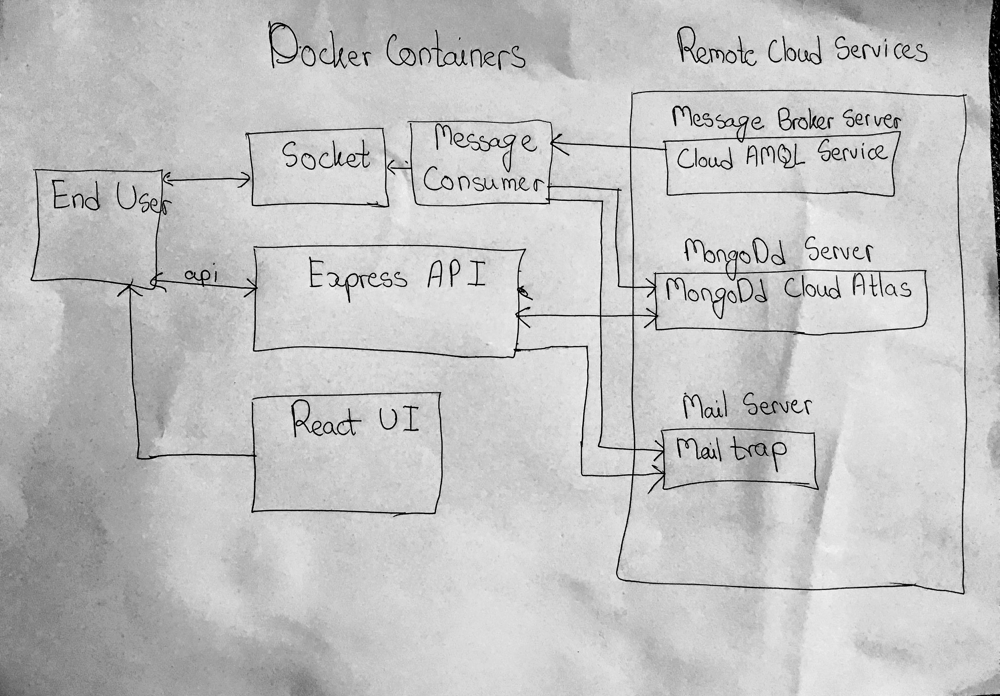

# Bulk Email Processor

This is a webapp for sending email to bulk email receipants present in excel file.

## Getting Started
1. Get the repo in your local directory.
>`git clone https://github.com/uprety/bulk-email-processor.git`
>```
>cd bulk-email-processor
>```

2. You need the following services in order to work:
```
1. MongoDb Server
2. Mail Server
3. Message Broker Server
```

3. Configure all the following environmental variables in your current session.
```
BEP_SERVER_URL="this app url where end user hit the addresss for backend; it is usually http://localhost:3030 in development"
BEP_ENV="development"
BEP_SESSION_SECRET="app secret code"

BEP_MONGODB_URL="your mongoDb URL with credentials"

BEP_MAILTRAP_CREDENTIAL="smtp://<mailtrap username>:<mailtrap password>@smtp.mailtrap.io:2525?pool=true&maxConnection=1&rateDelta=20&rateLimit=5"

CLOUDAMQP_URL="your message broker URL with credentials"
```

4. Install backend app packages: 
```
cd backend
npm install 
```
>If you are not in development environment, consume message queue by running  `npm run consumeQueue`.<br/>
>If you have not loaded Emali Template into Databse, do the seeding with `npm run seedMailTemplate` command.<br/>
>>Then **`npm run start`** to run the server 

5. In new terminal inside `bulk-email-processor` directory run frontend application:
```
cd frontend
npm install
npm run start
```
6. By default the server run at 3030 port. Open the following url to open the webapp.
>[localhost:3030](http://localhost:3030)

## Using docker
First complete upto step 3 given above. <br/>
Create image name `upreti/bulk-email-processor`:
```
docker build . -t upreti/bulk-email-processor
```
Then configure `docker-compose.yml` as per your requirement if needed. 
Create docker container:
```
docker-compose up
```


## Current Design


## Ideal Design
This app can be implemented in this way but required little bit of twiking

